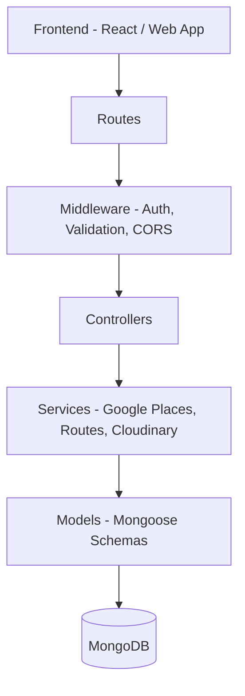
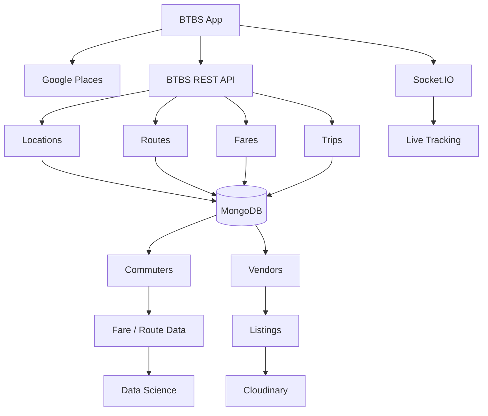
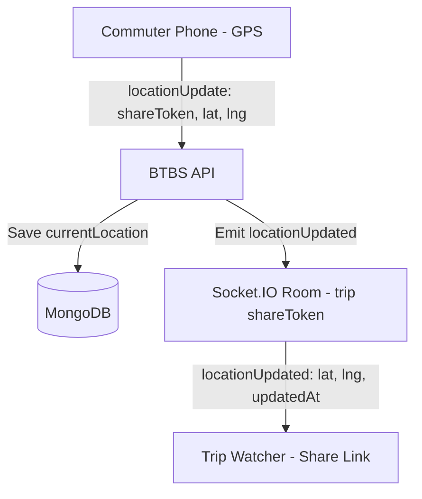
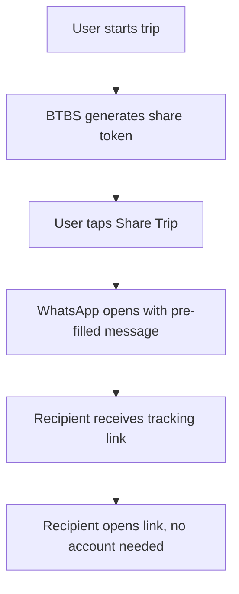

# Beyond the Bus Stop (BTBS)

Beyond the Bus Stop is a transportation platform that helps commuters discover routes, estimate fares, evaluate route confidence, report actual fares, discover nearby businesses, and share live trip locations with trusted contacts.

---

## Table of Contents

- [Features](#features)
- [Tech Stack](#tech-stack)
- [Architecture Overview](#architecture-overview)
- [Getting Started](#getting-started)
- [Environment Variables](#environment-variables)
- [API Reference](#api-reference)
- [Live Location Tracking](#live-location-tracking)
- [Trip Sharing](#trip-sharing)
- [Confidence Score](#confidence-score)
- [Project Structure](#project-structure)
- [Roadmap](#roadmap)

---

## Features

- 🔍 **Route discovery** — search known transportation routes between two locations
- 💰 **Fare estimation & confirmation** — commuters report actual fares, which feed a live confidence score
- 📍 **Google Places integration** — location search, autocomplete, and nearby safety points (hospitals, police, markets)
- 🧭 **Live trip sharing** — generate a public link that shows a trusted contact your live location on a map, with the road route drawn between origin and destination
- 🏪 **Business/vendor listings** — vendors create public listings with photos (Cloudinary)
- 🔐 **JWT auth with role-based access** — commuter, business/vendor, admin

---

## Tech Stack

| Layer | Technology |
|---|---|
| Runtime / Framework | Node.js, Express.js |
| Database | MongoDB + Mongoose |
| Auth | JWT |
| Validation | Express Validator |
| Real-time | Socket.IO |
| Location services | Google Places API, Google Routes API |
| Media storage | Cloudinary |
| Logging | Morgan |

---

## Architecture Overview

### Layered backend architecture



### End-to-end system overview



### Live location tracking flow



---

## Getting Started

```bash
git clone <this-repo>
cd btbs-backend
npm install
cp .env.example .env   # fill in real values, see below
npm run dev
```

Server runs on `http://localhost:<PORT>` (REST + Socket.IO on the same server/port).

**Quick backend sanity check** (no frontend needed):
```bash
node test-socket.js     # simulates the sharer — joins a trip, sends a fake location
node test-tracker.js    # simulates a watcher — joins the same trip, listens
```
If `test-tracker.js` prints `📍 LIVE LOCATION RECEIVED`, the whole real-time pipeline is confirmed working.

---

## Environment Variables

| Variable | Purpose |
|---|---|
| `PORT` | Server port |
| `MONGO_URI` | MongoDB connection string |
| `JWT_SECRET` | JWT signing secret |
| `JWT_EXPIRES_IN` | Token expiry (e.g. `1d`) |
| `GOOGLE_MAPS_API_KEY` | Google Places **and** Routes API key (enable both APIs in Google Cloud Console) |
| `CLOUDINARY_CLOUD_NAME` | Cloudinary account |
| `CLOUDINARY_API_KEY` | Cloudinary auth |
| `CLOUDINARY_API_SECRET` | Cloudinary auth |
| `EMAIL_USER` / `EMAIL_PASS` | Gmail credentials for OTP emails |
| `BREVO_API_KEY` / `BREVO_SENDER_EMAIL` | Brevo transactional email |

---

## API Reference

| Method | Endpoint | Purpose | Auth |
|---|---|---|---|
| POST | `/api/auth/...` | Register / login | — |
| GET | `/api/routes/search` | Search routes | — |
| GET | `/api/routes/:id` | Get a route | — |
| GET | `/api/routes` | List routes | — |
| POST | `/api/routes/create` | Create route | ✅ Business/Admin |
| PUT | `/api/routes/:id` | Update route | ✅ |
| DELETE | `/api/routes/:id` | Delete route | ✅ Admin |
| POST | `/api/confirmations` | Submit fare confirmation | ✅ |
| GET | `/api/confirmations/routes/:routeId` | Get route confirmations | — |
| PATCH | `/api/confirmations/:confirmationId` | Update confirmation | ✅ |
| DELETE | `/api/confirmations/:confirmationId` | Delete confirmation | ✅ |
| GET | `/api/locations/search` | Google location search | — |
| GET | `/api/locations/nearby` | Nearby places (hospitals, police, markets) | — |
| POST | `/api/trips` | Create trip | ✅ |
| PATCH | `/api/trips/:tripId/start` | Start trip | ✅ |
| PATCH | `/api/trips/:tripId/end` | End trip | ✅ |
| GET | `/api/trips/:tripId/share` | Get share link + WhatsApp message | ✅ |
| GET | `/api/trips/public/:shareToken` | Public trip view (no auth) | — |
| GET | `/api/trips/public/:shareToken/directions` | Road route polyline between origin/destination | — |
| PATCH | `/api/trips/:tripId/location` | Update trip location (REST fallback) | ✅ |
| POST | `/api/listings` | Create business listing | ✅ Vendor |
| GET | `/api/listings/my` | Vendor's own listings | ✅ |
| GET | `/api/listings` | Public listing discovery | — |
| GET | `/api/listings/:listingId` | Listing details | — |
| POST | `/api/upload` | Upload photos (multipart) | ✅ |

---

## Live Location Tracking

Real-time tracking runs over Socket.IO, attached to the same HTTP server as the REST API. Each shared trip is a room named `trip:<shareToken>`.

**Server events:**

| Event (client → server) | Payload | Purpose |
|---|---|---|
| `joinTrip` | `shareToken` | Watcher joins a trip's room, receives last known position immediately |
| `locationUpdate` | `{ shareToken, latitude, longitude }` | Sharer broadcasts a new position |
| `stopLocationSharing` | `shareToken` | Sharer ends tracking |

| Event (server → client) | Payload | Purpose |
|---|---|---|
| `locationUpdated` | `{ tripId, latitude, longitude, updatedAt }` | Broadcast to all watchers in the room |
| `tripError` | `{ message }` | Trip not found / not active |
| `locationSharingStopped` | — | Sharer ended the trip |

Location can also be pushed via REST (`PATCH /api/trips/:tripId/location`) — it updates MongoDB and emits the same `locationUpdated` socket event, so either path keeps watchers in sync.

**Route visualization:** `GET /api/trips/public/:shareToken/directions` calls the Google Routes API using the trip's stored origin/destination `placeId`s and returns an encoded polyline plus origin/destination coordinates, so the frontend can draw the road route alongside the live-moving marker.

> ⚠️ **Known gap:** the frontend's location-sending code must call something that repeats (`watchPosition`, or a repeating interval) — a single one-shot location call will only ever send the starting position.

---

## Trip Sharing



Sharing is WhatsApp-based rather than an internal messaging system, keeping the MVP flow lightweight. Recipients access the trip via a public, unauthenticated `shareToken` link.

---

## Confidence Score

Route confidence is a weighted composite of six factors:

| Component | Weight | Basis |
|---|---|---|
| Report Strength | 20% | `report_count ÷ 20`, capped at 100% |
| Fare Agreement | 30% | % of reports within ±10% of the median fare |
| Data Freshness | 15% | Recency of most recent report (168-hour horizon) |
| Fare Fairness | 15% | 1–5 rating rescaled: `(avg − 1) ÷ 4 × 100` |
| Overcharge Evidence | 10% | % of reports indicating overcharge (fewer = stronger) |
| Ease Finding Transport | 10% | 1–5 rating rescaled: `(avg − 1) ÷ 4 × 100` |

---

## Project Structure

```
BTBS-BACKEND
├── app.js
├── public/                  # static test/viewer pages (live-map-viewer.html, sharer-test.html)
├── src
│   ├── config
│   ├── controllers
│   ├── middleware
│   ├── models
│   ├── routes
│   ├── services          # googleMaps.service.js — Places + Routes API calls
│   └── validators
├── test-socket.js           # simulates trip sharer for local testing
├── test-tracker.js          # simulates trip watcher for local testing
└── .env
```

---

## Roadmap

- [ ] Confirm frontend location-sending uses continuous tracking (`watchPosition`/interval), not a one-shot call
- [ ] Render live location + route line + origin/destination markers on the production map
- [ ] Complete two-field origin/destination search experience
- [ ] Nearest-route matching using selected coordinates
- [ ] End-to-end trip testing under real network conditions
- [ ] Replace temporary confidence calculation with final Data Science model, where not already complete
- [ ] Security & validation review
- [ ] Automated test coverage
- [ ] Production deployment hardening
